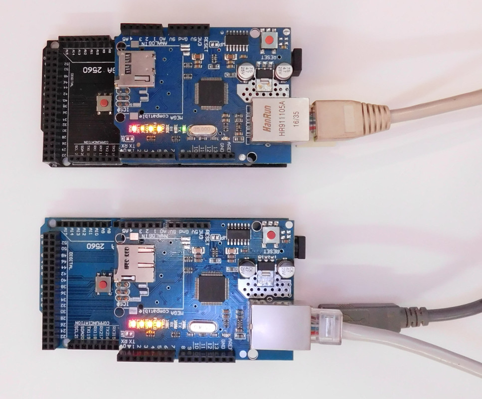

<h1><a target="_blank" href="https://jrelo.com">Jrelo</a> - control and monitoring of remote devices.</h1>
<h2>Control Arduino over the Internet.</h2>

<h2>
    Implementations of units for the Arduino MEGA 2560.
</h2>
<ui>
    <li><b>EthernetPUnit</b> - unit uses EthernetShield W5100. Data transfer through HTTP Polling.</li>
    <li><b>EthernetPXUnit</b> - unit uses EthernetShield W5100. Data transfer through Polling (with StringBox).
    </li>
    <li><b>EthernetWUnit</b> - unit uses EthernetShield W5100. Data transfer through WebSocket.</li>
    <li><b>EthernetWXUnit</b> - unit uses EthernetShield W5100. Data transfer through WebSocket (with StringBox).
    </li>
    <li><b>GSMPXUnit</b> - unit uses SIM board. Data transfer through HTTP(S) Polling (with StringBox).</li>
</ui>

<i>See examples <a target="_blank" href="https://jrelo.com/archives/category/examples-ru/arduino">here</a>.</i>

 
<h2>
    Modules (compatible with all unit implementations)
</h2>

<ui>
    <li><b>BMP180PressureModule</b> - BMP180 sensor for measuring pressure (wrapper).</li>
    <li><b>BMP180TemperatureModule</b> - BMP180 sensor for temperature measurement (wrapper).</li>
    <li><b>DallasTemperatureModule</b> - Dallas 18B20 sensor for temperature measurement (wrapper).</li>
    <li><b>DHTHumidityModule</b> - DHT sensor for measuring humidity (wrapper).</li>
    <li><b>DHTTemperatureModule</b> - DHT sensor for temperature measurement (wrapper).</li>
    <li><b>GPSModule</b> - GPS module for different location providers.</li>
    <li><b>EventSchedulerModule</b>, <b>WorkSchedulerModule</b> - event schedule.</li>
    <li><b>LifetimeModule</b> - lifetime.</li>
    <li><b>MultiRelayModule</b> - relay set.</li>
    <li><b>MultiRelaySSModule</b> - relay set (state saving).</li>
    <li><b>RelayModule</b> - relay.</li>
    <li><b>RelaySSModule</b> - relay (state saving).</li>
    <li><b>TimeModule</b> - real time in unit.</li>
</ui>

<i>Wrapper - adapter class using the functionality of a third-party library</i>

 
<h3>Example of a unit with two modules</h3>

<pre>
#include &lt;EthernetPUnit.h&gt;
#include &lt;LifetimeModule.h&gt;
#include &lt;RelayModule.h&gt;

byte mac[] = { 0xDE, 0xAB, 0xDE, 0xEF, 0xFF, 0xEF };
const char *uuid = "00000000-0000-0000-0000-0000000";
const char *connectionPassword = "00000000000000000000000000000";

EthernetPUnit unit(uuid, connectionPassword, mac);
LifetimeModule ltm(&quot;lt&quot;); // "lt" - module key
RelayModule rm(&quot;rm&quot;, 22); // "rm" - module key, 22 - pin

void setup() {
    Serial.begin(9600);
    unit.putModule(&amp;ltm);
    unit.putModule(&amp;rm);
}

void loop() {
    unit.update();
}
</pre>
 

 

<h2>
    Utilities for working with strings
</h2>

    <h3>StringBox</h3> Storage for string variables allowing dynamic work with arrays characters. Uses its own allocated
    memory to store strings.
    
Advantage :

    <ul>
        <li>Does not lead to controller memory fragmentation.</li>
        <li>Automatic defragmentation of own memory.</li>
    </ul>
    
Disadvantages :

    <ul>
        <li>Pre-allocation of memory</li>
        <li>Cannot expand memory more than allocated</li>
        <li>128 string limit</li>
    </ul>

 

    <h3>StringBuffer</h3> Buffer for storing and concatenating strings. StringBuffer with StringBufferUtils may be
    alternatives
    for class String. Uses to work StringBox.
    
Advantage :

    <ul>
        <li>Automatically expands memory internal buffer</li>
        <li>Ability to clear unnecessary allocated memory</li>
        <li>Work speed</li>
    </ul>
    
Disadvantages :

    <ul>
        <li>StringBox required</li>
    </ul>

<i>See examples <a target="_blank"
                      href="https://github.com/jrelo-com/libraries/blob/master/JreloUtils/examples/StringBox/StringBox.ino">here</a>
    and <a target="_blank"
           href="https://github.com/jrelo-com/libraries/blob/master/JreloUtils/examples/StringBuffer/StringBuffer.ino">here</a>.</i>

